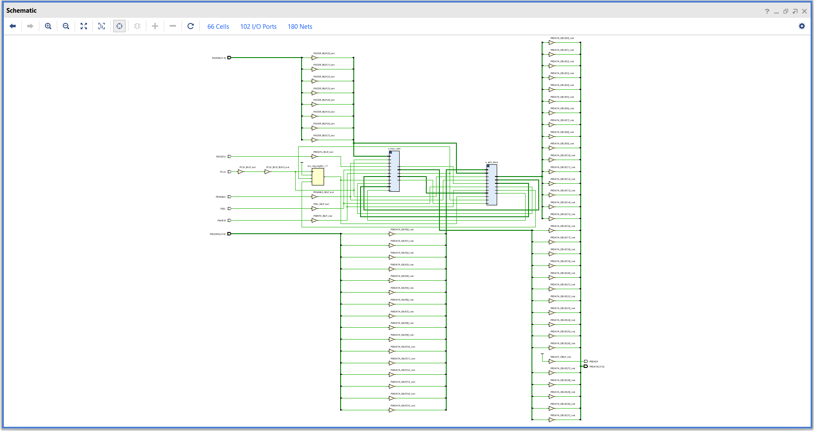
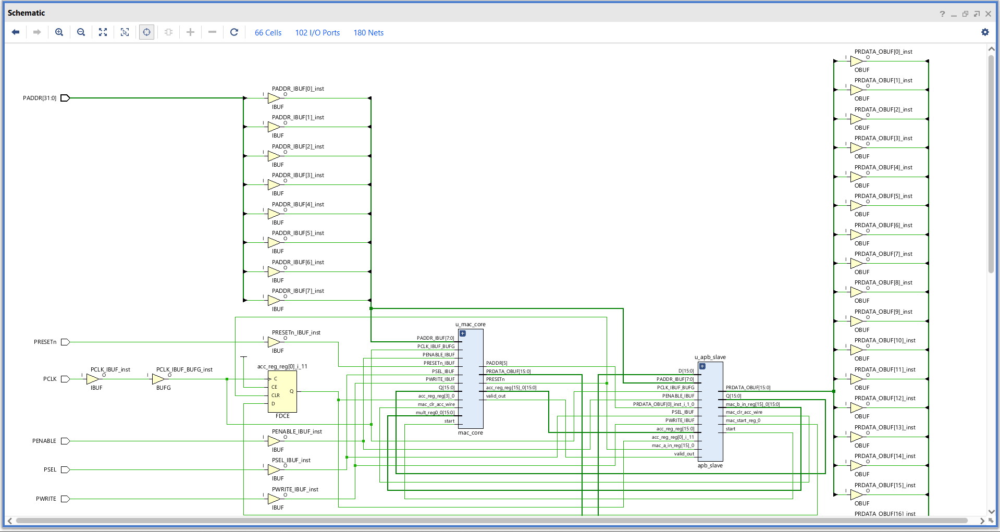
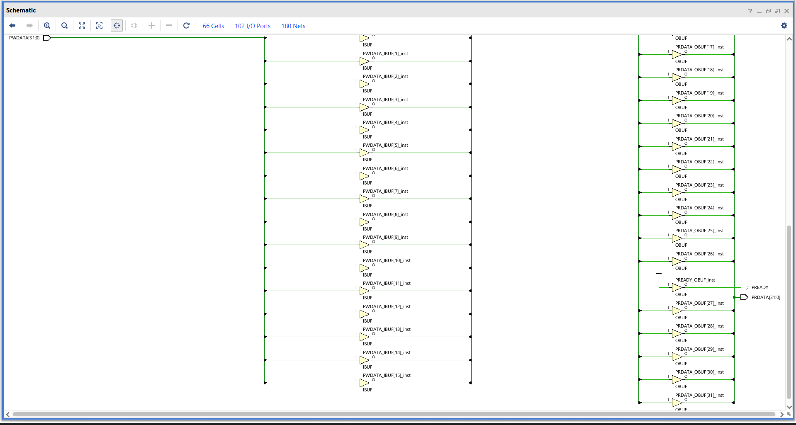
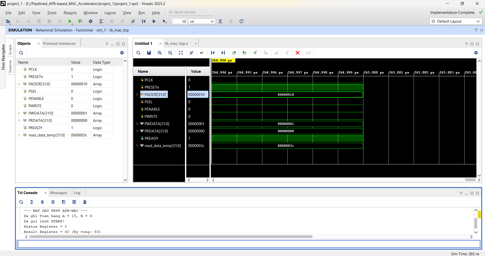
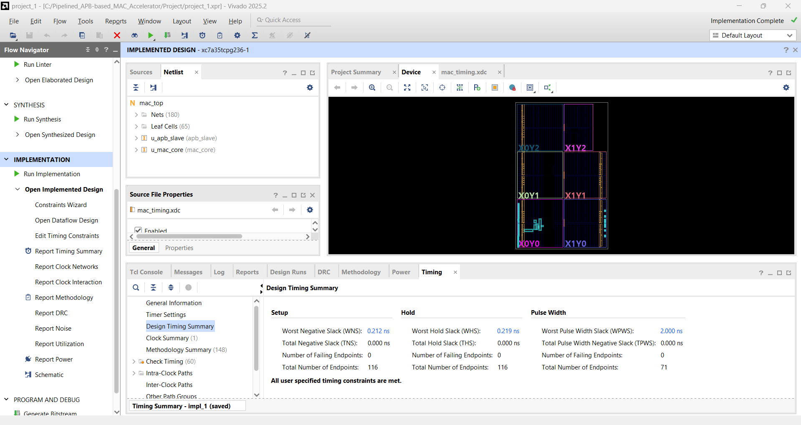
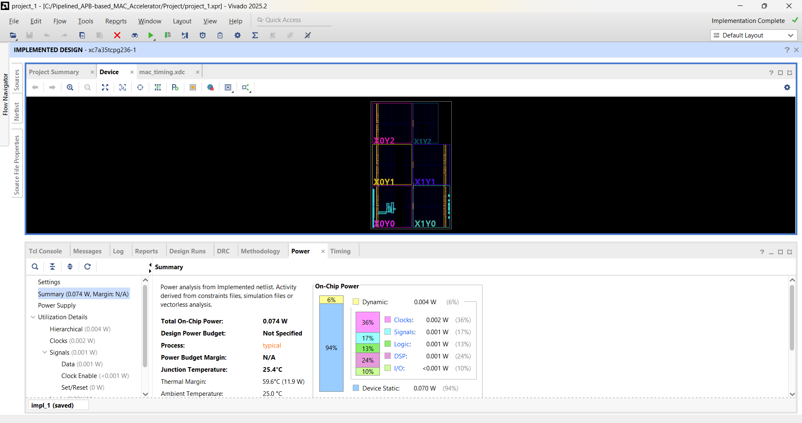

# Pipelined MAC Accelerator with AMBA APB 3.0 Interface

## Overview
This repository contains the RTL design, verification, and physical implementation (STA) of a 32-bit Multiply-Accumulate (MAC) hardware accelerator. The design is fully integrated with an **AMBA APB 3.0 Slave** interface, making it ready to be plugged into modern System-on-Chip (SoC) architectures. 

To achieve high throughput and resolve timing bottlenecks, the MAC core features a **2-stage pipelined architecture**, effectively minimizing the critical path delay for high-frequency operations.

## System Architecture
The system is divided into two primary hardware modules:
1. **MAC Core (`mac_core.v`)**: The computational heart of the system. It isolates the multiplier and the adder into two separate pipeline stages to ensure no Setup Time violations occur at high frequencies.
2. **APB Slave Interface (`apb_slave.v`)**: Acts as the bridge between the system bus and the MAC Core. It decodes the address, manages the `Setup` and `Access` phases, and ensures zero wait-state transactions (`PREADY = 1`).

### Register Map
| Address Offset | Register Name | Access | Description |
| :--- | :--- | :--- | :--- |
| `0x00` | `CTRL_REG` | W | Bit 0: Start, Bit 1: Clear Accumulator |
| `0x04` | `STATUS_REG` | R | Bit 0: Valid Output Flag |
| `0x08` | `OP_A_REG` | R/W | 16-bit Operand A (Signed) |
| `0x0C` | `OP_B_REG` | R/W | 16-bit Operand B (Signed) |
| `0x10` | `RESULT_REG` | R | 32-bit Accumulated Result |

## Functional Verification (DV)
Functional verification was performed using a custom Bus Functional Model (BFM) simulating an APB Master inside the Testbench (`tb_mac_top.v`). The stimulus effectively tests pipeline latency, data skew handling, and accurate APB handshaking.

## Logic Synthesis & Static Timing Analysis (STA)
The RTL code was synthesized and analyzed using **Xilinx Vivado 2025.2**. Strict Timing Constraints (SDC/XDC) were applied to evaluate the pipeline's efficiency and ensure complete timing closure.

* **Target Device**: Xilinx Artix-7 FPGA (`xc7a35tcpg236-1`)
* **Target Clock Frequency**: 100 MHz (Period: 10.000 ns)
* **Worst Negative Slack (WNS)**: **+4.706 ns** (Timing Met)
* **Estimated Maximum Frequency (Fmax)**: **~188.8 MHz**

By isolating the multiplier and adder into distinct pipeline stages, the design achieved significant positive slack without any Setup/Hold violations. Furthermore, the synthesis tool successfully mapped the multiplication logic into dedicated **DSP48 slices**, drastically reducing LUT usage and combinational logic delay.

### Resource Utilization & Power Estimation
The design demonstrates a highly optimized footprint and extreme power efficiency:

## Key Learnings & Backend Methodologies
* RTL to Gate-Level mapping and preventing latch inference.
* IP Reuse and Standard Bus Interfacing (AMBA 3.0 APB).
* Deep Pipelining & Critical Path Delay reduction strategies.
* Reading Static Timing Analysis (STA) reports to evaluate Data Skew, Setup/Hold margins, and Maximum Operating Frequency (Fmax).
